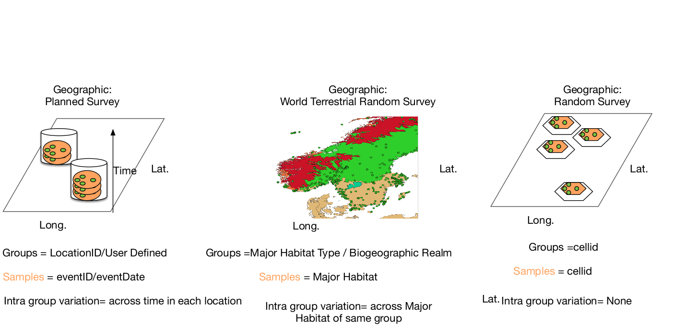

# PhyloH_WebApp
Describe and queue bug report

Phylo WPS Client - Step by Step Tutorial

M. Santoro, S. Vicario

# Introduction#

This document provides a step by step guide to use the Web GUI (Graphical User INterface) of the Phylo Web Processing Service. The GUI is available at

http://testwps.geodab.eu/wps/testUI/

The GUI was tested using the following browsers: Google Chrome, Microsoft Edge, Safari.
Model Description
The left side navigation panel provides the list of available models, presently only Phylo model is available (Fig. 1).

Figure 1

 It is possible to view the model description by clicking the “More Info” button at the left the model title. A description of the model is displayed along with a link to Git Hub repository of the python script executed to run the actual computation (Fig. 2)

Figure 2
# Run in Normal mode#

On page load, all input parameters are empty. Three file are required, while another is optional.   It is possible to run the model with default inputs. To do this, users click the “Run Default” button. The default inputs are the following:

* Sample file: 
 i.e. https://raw.githubusercontent.com/svicario/phyloH/master/test/sampleTest
        Three columns Tabbed file with no header: sample name, count, taxon label
        A row for each observation

* Group file: 
i.e. https://raw.githubusercontent.com/svicario/phyloH/master/test/GroupTest
        Two columns tabbed file with no header: sample name, group name
        A row for each sample
* Phylogeny file: 
i.e. https://raw.githubusercontent.com/svicario/phyloH/master/test/Echinodermata.tree
A tree representation in newick format with label matching taxon label of sample file
* Taxonomy file:
i.e. https://cloud.recas.ba.infn.it:8080/v1/AUTH_fb6d6fcd0e194a96bb6d0420dce8332f/backgroundinfo/taxEchino.tabular 
A representation of the taxonomy of each taxon label, first the taxon label, then the different taxon rank from the highest to the lowest separated by pipe symbol

The correspondent input fields are filled with default values by the GUI and a run execution tab is created to view execution status (see section “Execution Status”).
# Geographic Modes#
                          
Observations can be assigned to Sample and Group using geographic information in three different ways:

a)  

b) 

Figure 3
 In the geographic modes all mandatory information can be included in the sample file, that in these mode is a comma separated value file. Headers are needed and follow darwin core terms (http://rs.tdwg.org/dwc/terms/). Figure 3a depict as a logic schema the choice, while the figure 3b show the actual GUI on the web application. In the first option the user is required to define the header to assign Sample to Group, while sample are defined by eventID or eventDate headers. In the second option, the user need to define if Major Habitat type or Biogeographic realm would define Group, while sample is defined by Major Habitat, all following Nature Conservancy classification (http://maps.tnc.org/gis_data.html). Finally last option require that user commit on a size of the cell grid in meters to perform under a EASE 2.0 projection the construction of hexagonal grid and assign observation to cell-id of the grid and use it both for Group and Sample definition.          
# Secondary Parameters#

All mode of analysis require the evaluation of 4 secondary parameters: 
1. Number of permutation. The significance of Beta diversity is evaluated with a permutation procedure of taxon label across Sample and Group. The significance is evaluated on overall count and for the contribution of each lineage and each environment in the Group variable. In this last two case a boolean vector indicates if the value is significant at 0.05 using a sequential Bonferroni procedure.
2. maximum time of waiting. The backend platform allow for 24 hour calculation at maximum, but the frontend GUI will check for no more than the time requested by the user. After this time the user can manually check when the result URL will be accessible.
3. enforce or not that all sample have equal contribution to observations
4. ask also for a pairwise comparison of all sample, without permutation analysis.                   
## Optional/Mandatory parameters##
It is possible to use different parameter values and combinations. Users can insert the values into the form fields. The GUI validates inputs provided by users. After all mandatory input parameters have been inserted with valid values, the “Run” button is enabled and the model can be executed. When one or more of the required inputs is missing, or when one or more of the provided parameter values is invalid the “Run” button is disabled.
Required inputs are displayed with a “*” next to their title. The only exception is the “Group observations based on Nature Conservancy Terrestrial Ecoregion” parameters. When this is switched on, the form will stay invalid (“Run” button disabled) until users select one of the two displayed option.  
#Execution Status#
When a run is launched (either default or with custom values), a run  tab is created below the “Run” button. Run tabs are composed as in Fig. 3:
* Developer options
   * Show WPS status URL: shows the link to the WPS XML status document;
   * Show JSON request: show the json request that was submitted to the computing infrastructure for model execution;
* Output:
   * Download: after execution successfully ends, this button is enabled and allows downloading the out archive to users’ machine;
   * Show Output URL: after execution successfully ends, this can be enabled to visualize the link for downloading the output;
* Execution Status: displays the different phases of execution status; if an error occurs, it is displayed in this section.

 

Figure 3

# Description of Outputs#  

## The HTML report##

A main result file is available: an html report, in which all statistics are reported in tables and the contribution on lineage is drawn on a dynamic tree representation. 
On the top of the report an index allows to move across the different sections
Tree representation
Stacked histogram on each tip show observed counts, circle of growing size and darker red indicated growing contribution of each node (terminal or internal) to overall beta distribution. It is possible to interrogate each node by clicking on it. Once clicked it is possible to collapse all descendant of the node, to redraw the tree only with descendant of the node, to print the row of the large table relative to that node with all information related (relative frequencies of descendant of that clade in each environment, contribution to beta diversity, contribution to diversity of sample within the environment, p-values and significances corrected with sequential bonferroni to be different from zero for each contributions). The possibility to redraw the tree with only descendant allows to navigate in large tree and explore on section of interest. Once found the section of interest, it is possible to export the subtree in newick format, together with two other secondary files present in the output, upload on the webtool ITOL to reproduce the graph and add other decorations and annotations.

## Geographic output##

In case of geographic mode a second main output is present: a shapefile. The file report the contribution of the sample and groups to beta diversity and relative p-value and significance in a geographically explicit context.  Shapefile is the most common standard of interchange for geographic information and user can visualize with several opensource and non software. We report how to visualize it with the opensource software Qgis (http://qgis.org/en/site/).
1. Drag the file with extension shp onto Qgis 
2. Select the loaded layer from Legend list, and select property.
3. Click on the Style tab
4. From the pulldown menu select Gradient, and select the column of interest (Diversity or Beta Diversity)
5. Select Blues from the “scale of color”
6. Push button classify and then Apply
Now the different Sample area are colored with the contribution to Diversity or Beta Diversity of the group to which they belong. 

For Beta diversity is possible to assess if the value is significantly different from zero. So it is possible to exclude those cell in which the too few observations  do not ensure that the measured difference from the average cell  it is not due to sampling artifact.
The shapefile include a Beta_Diversity ( estimated value), Beta_pvalue (the percentage of replicates in the permutation procedure that are larger than estimated value), and the Beta_SignSe ( if the estimated is still significant at 0.05 after performing a sequential Bonferroni correction for multiple test). 
To mask non significant cell use the following procedure on QGis

1. Select the loaded layer from Legend list, and select property.
2. Click on the Style tab
3. From pulldown menu select “rule-based rendering”
4. Select all cases of Beta diversity previously defined
5. Push “refine selected rule” and then select Beta_SignSe and then classify ( see figure )
   
6. Select all value that are not False  and eliminate them with the eliminate buttom, then press “ok”
   
